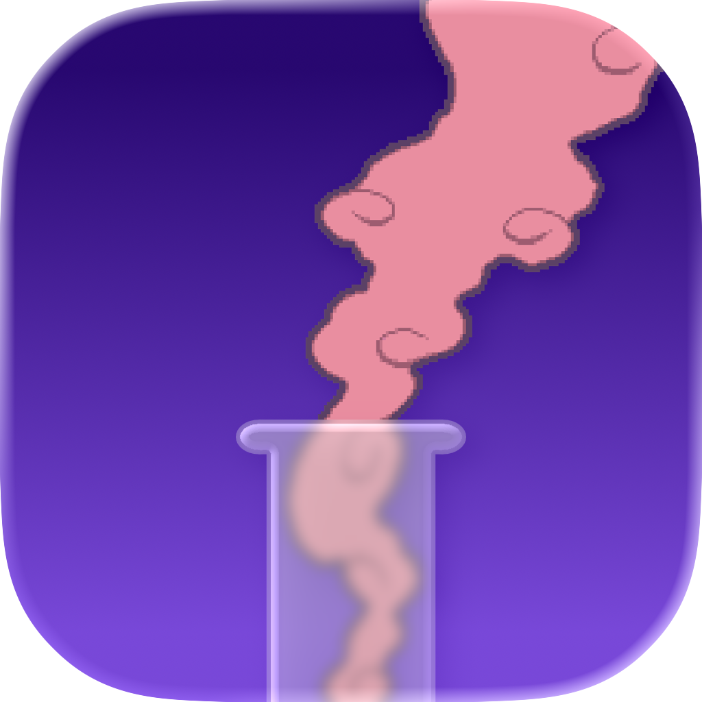

  

<h1 align="center">Dream Mist</h1>

  A native macOS server emulator for Pokémon Black, White, Black 2 and White 2 versions' Game Sync and Dream World.

  
  

This is a Swift rewrite of [Entralinked](https://github.com/kuroppoi/entralinked) by [kuroppoi](https://github.com/kuroppoi), rebuilt from the ground up as a native macOS app using SwiftUI and Apple's networking frameworks. It stands in for Nintendo's discontinued Wi-Fi Connection servers, letting *Black*, *White*, *Black 2*, and *White 2* connect to Game Sync again on real hardware.

## Features

- Emulates the GameSpy/NAS login handshake so the game can authenticate over Wi-Fi
- Runs the Dream World tuck-in / wake-up cycle
- Runs Join Avenue visitor/shop syncing (Black 2 & White 2)
- A SwiftUI dashboard for editing your dream data — encounters, held items, Avenue visitors, and cosmetics — without needing to actually dream in-game
- Supports every official language release (Japanese, English, French, Italian, German, Spanish, Korean)

## Requirements

- macOS 26 (Tahoe) or later
- A Nintendo DS/DSi/3DS and a legitimate copy of Black, White, Black 2, or White 2
- Both devices on the same local network

## Usage

1. Launch Dream Mist — it starts the DNS/GameSpy/HTTP servers automatically.
2. On your DS, set the primary DNS server (in Internet Settings) to the local IP address shown at the bottom of the Dashboard login screen.
3. Connect to Game Sync in-game and tuck in a Pokémon.
4. Back in Dream Mist, log into the Dashboard with the Game Sync ID from the game's Game Sync Settings menu.

> **Note:** Release builds aren't notarized yet. The first time you open Dream Mist, right-click the app and choose **Open** to bypass Gatekeeper's "unidentified developer" warning.

## Building from source

Open `Dream Mist.xcodeproj` in Xcode 26+ and run the `Dream Mist` scheme.

## Credits

The Pokémon species/ability/item data used by the dashboard UI (`Dream Mist/Dashboard/Resources`) is borrowed from entralinked; see [NOTICE.md](Dream%20Mist/Dashboard/Resources/NOTICE.md) for full attribution.

## License

[MIT](LICENSE)
